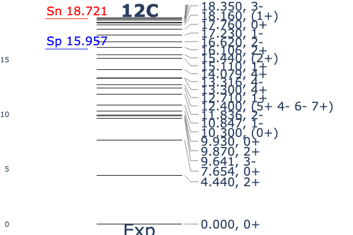

# Nuclear_Data_and_Energy_Levels_Viewer
This Python code is a tool for analyzing and visualizing nuclear data. It uses the public API of the LiveChart of Nuclides from the International Atomic Energy Agency (IAEA) to retrieve information on isotopes, calculate energies, and plot energy level diagrams.

# IAEA Nuclear Data Viewer

A Python tool that interacts with the [IAEA LiveChart API](https://www-nds.iaea.org/relnsd/vcharthtml/api_v0_guide.html) to fetch, compute, and visualize experimental nuclear data.

## 🚀 Features

* **Real-time Data Fetching:** Directly queries the IAEA API for up-to-date nuclear properties.
* **Physics Calculations:** Computes separation energies ($S_n$, $S_p$, $S_d$, etc.) based on mass differences.
* **Interactive Visualization:** Uses Plotly to render energy level diagrams, complete with an anti-overlap algorithm for state labels and visual markers for separation energy thresholds.

## 🛠️ Prerequisites

Make sure you have Python installed. Then, install the required dependencies:

```bash
pip install -r requirements.txt
```

## 💻 Usage

Run the script from your terminal:

```bash
python nuclear_viewer.py
```

To analyze a different isotope, open `nuclear_viewer.py` and modify the execution block at the bottom of the script:

```python
if __name__ == "__main__":
    target = "16O"       # Change to your desired isotope (e.g., "235U")
    max_energy = 15      # Adjust the max energy for the plot in MeV
    
    print_isotope_info(target)
    plot_energy_levels(target, max_energy)
```

## 📊 Example Output

Here is an example of the energy level diagram generated for Carbon-12:


